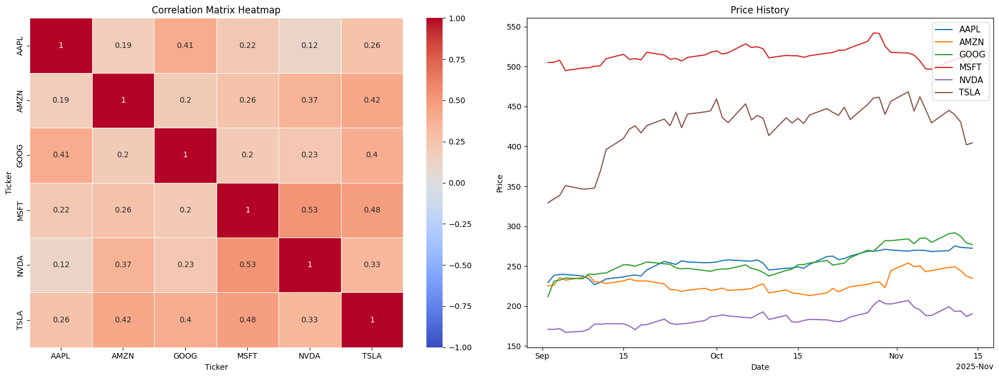
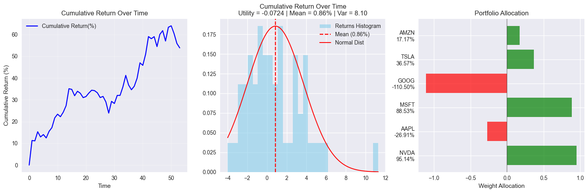
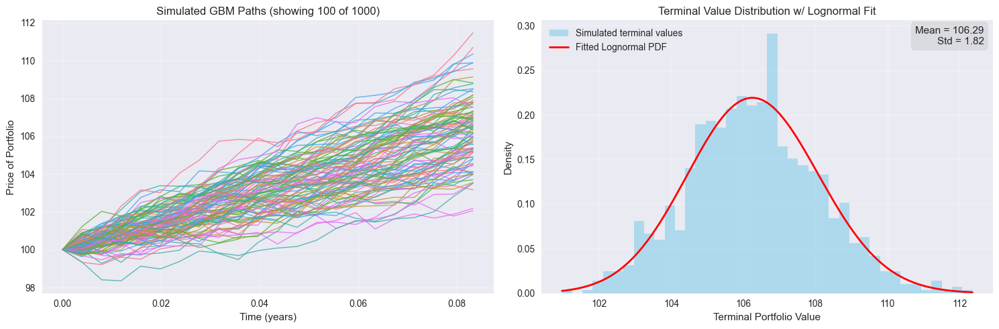

# 📊 Optimal Portfolio Allocation

A comprehensive Python project for optimal portfolio allocation using various optimization strategies, robust estimation methods, and Monte Carlo simulation. This project implements modern portfolio theory techniques to construct efficient portfolios and analyze their performance.

## Features

- **Data Processing**: Download and process stock data from Yahoo Finance
- **Robust Estimation**: Campbell's robust method for mean and covariance estimation to handle outliers
- **Shrinkage Estimators**: James-Stein type shrinkage for reducing estimation error
- **Portfolio Optimization**: Multiple optimization strategies including:
  - Maximum Utility Portfolio
  - Minimum Variance Portfolio (MVP)
  - Maximum Sharpe Ratio Portfolio
  - Return per Risk Portfolio
- **Visualization**: Comprehensive plots for data analysis, portfolio performance, and distributions
- **Monte Carlo Simulation**: Geometric Brownian Motion simulation for portfolio value forecasting

## Visualization Examples

### Data Insights

The data insight plot shows:
- Correlation matrix heatmap displaying relationships between assets
- Price history time series for all stocks in the portfolio

### Return Distribution Analysis

This visualization compares empirical return distributions with Gaussian distributions for each stock, providing insights into the distribution characteristics and normality assumptions.

### Portfolio Performance and Weights

Comprehensive portfolio analysis including:
- Cumulative return over time
- Return distribution histogram with normal distribution overlay
- Portfolio weight allocation across assets

### Monte Carlo Simulation

Geometric Brownian Motion simulation results:
- Simulated price paths over time
- Terminal value distribution with lognormal fit
- Statistical summary (mean and standard deviation)

## Portfolio Optimization Strategies

This project implements several advanced portfolio optimization strategies based on Modern Portfolio Theory (MPT). Each strategy solves a different optimization problem to find optimal asset weights that satisfy different objectives and constraints.

### 1. Maximum Utility Portfolio (`Max_util`)

**Objective**: Maximize investor utility based on mean-variance preference, balancing expected returns against portfolio risk according to the investor's risk tolerance.

**Use Cases**:
- Customizable risk-return tradeoff based on investor preferences
- Direct incorporation of investor's risk tolerance
- Suitable for investors with clear utility preferences

**Key Features**:
- Risk aversion parameter `A` controls the risk-return tradeoff
- Higher `A` values lead to more conservative portfolios (higher weight on low-risk assets)
- Lower `A` values allow for more aggressive strategies

**Advantages**:
- Explicitly models investor risk preferences
- Provides intuitive control over risk-return tradeoff
- Well-established theoretical foundation

---

### 2. Minimum Variance Portfolio (`mvp`)

**Objective**: Minimize portfolio variance/volatility to achieve the lowest possible risk. Can optionally be constrained to achieve a specific target expected return.

**Use Cases**:
- Risk-averse investors prioritizing volatility reduction
- Foundation portfolio for other optimization strategies
- Long-only or long-short implementations

**Key Features**:
- Provides the minimum risk portfolio on the efficient frontier
- Can be constrained to achieve a specific target return
- Analytical solution is available

**Advantages**:
- Minimizes downside risk
- Well-suited for risk-averse investors
- Provides efficient frontier endpoint

---

### 3. Maximum Sharpe Ratio Portfolio (`MaxSharpe`)

**Objective**: Maximize risk-adjusted return by optimizing the Sharpe Ratio, which measures excess return per unit of risk. Requires a risk-free rate to calculate excess returns.

**Use Cases**:
- Optimal portfolio when risk-free asset is available
- Maximizing risk-adjusted returns
- Benchmarking portfolio performance

**Key Features**:
- Finds the tangency portfolio on the efficient frontier
- Maximizes return per unit of risk
- Analytical solution is available

**Advantages**:
- Optimal portfolio in mean-variance space when risk-free asset exists
- Best risk-adjusted performance metric
- Industry standard for portfolio evaluation

---

### 4. Return per Risk Portfolio (`RtnPerRisk`)

**Objective**: Create a portfolio using inverse variance weighting adjusted for expected returns, providing a simple risk-adjusted weighting scheme.

**Use Cases**:
- Simple risk-adjusted weighting scheme
- Inverse volatility weighting with return adjustments
- Quick portfolio construction

**Key Features**:
- Inverse covariance weighting adjusted for expected returns
- Simpler alternative to full optimization
- Computationally efficient

**Advantages**:
- Fast computation
- Intuitive weighting scheme
- Good baseline for comparison

## Robust Estimation Methods

Accurate estimation of mean returns and covariance matrices is critical for portfolio optimization. However, financial data often contains outliers and estimation errors. This project implements advanced robust estimation techniques to handle these challenges.

### Campbell's Robust Estimation (`campbell_robust_est`)

**Problem Addressed**: Standard sample mean and covariance estimators are sensitive to outliers, which are common in financial returns data. A few extreme returns can significantly distort portfolio weights.

**Methodology**: Campbell's robust estimation method uses Mahalanobis distances to identify and downweight outliers. The method calculates distances for each observation, assigns lower weights to extreme observations that exceed a threshold, and then recalculates mean returns and covariance matrix using these weights. This process iteratively identifies outliers and reduces their influence on the final estimates.

**Key Parameters**:
- `b1` (default: 2.0): Controls the threshold distance beyond which observations are downweighted
  - Higher values allow more extreme observations before downweighting
  - Lower values are more aggressive in downweighting outliers
- `b2` (default: 1.25): Controls the rate of weight decay for outliers
  - Higher values provide smoother weight transitions
  - Lower values cause steeper weight reductions

**Use Cases**:
- Portfolio optimization with noisy or outlier-contaminated data
- Handling market crashes or extreme events in return data
- Improving portfolio stability in volatile markets
- Reducing the impact of data errors or reporting anomalies

**Advantages**:
- Reduces impact of outliers on portfolio weights
- More stable portfolio allocations
- Better performance in presence of fat-tailed return distributions
- Automatic identification and downweighting of extreme observations

**When to Use**:
- Working with high-volatility assets
- Data contains suspected outliers or errors
- Portfolio weights seem unstable or extreme
- Market conditions include unusual events

---

## Shrinkage Estimator (`shrinkage_mean_return`)

**Problem Addressed**: In small samples or when the number of assets approaches the sample size, sample mean returns have high estimation error. The James-Stein paradox shows that shrinking sample means toward a common target can reduce total mean-squared error.

**Methodology**: The shrinkage estimator shrinks sample mean returns toward the minimum variance portfolio (MVP) return, effectively borrowing strength across assets to reduce estimation error. The method calculates how similar the sample means are to the MVP return, determines an optimal shrinkage intensity based on this similarity, and then creates a weighted average between the sample means and the MVP return. The shrinkage intensity automatically adjusts based on the data quality and dimensionality.

**Interpretation**:
- When sample means are similar to MVP return → s_w → 1 (more shrinkage)
- When sample means differ significantly → s_w → 0 (less shrinkage)
- Shrinkage intensity automatically adjusts based on data quality

**Key Properties**:
- **Adaptive Shrinkage**: Shrinkage intensity depends on the data
- **Theoretical Optimality**: Minimizes expected mean-squared error
- **Small Sample Bias Reduction**: Particularly effective when n is close to k
- **Bayesian Interpretation**: Can be viewed as Bayesian estimation with an informative prior

**Use Cases**:
- Portfolio optimization with limited historical data
- High-dimensional portfolios (many assets relative to observations)
- Reducing estimation error in mean returns
- Stabilizing portfolio weights across rebalancing periods

**Advantages**:
- Reduces mean-squared error of return estimates
- More stable portfolio weights
- Better out-of-sample performance
- Automatic adjustment of shrinkage intensity
- Well-grounded in statistical theory

**When to Use**:
- Number of assets is large relative to sample size
- Sample period is short
- Portfolio weights exhibit high variability
- Looking to improve out-of-sample performance

---

## Optimization Strategy Selection Guide

| Strategy | Best For | Risk Profile | Key Parameter |
|----------|----------|--------------|---------------|
| **Max_util** | Custom risk preferences | Adjustable via A | Risk aversion (A) |
| **MVP** | Risk minimization | Very low | Target return (optional) |
| **MaxSharpe** | Risk-adjusted returns | Moderate | Risk-free rate (r) |
| **RtnPerRisk** | Quick implementation | Moderate | None |

## Notes

- All portfolios are normalized to sum to 1
- Log returns are used throughout for computational convenience
- The project assumes daily returns for calculations
- Monte Carlo simulation uses a fixed random seed for reproducibility

