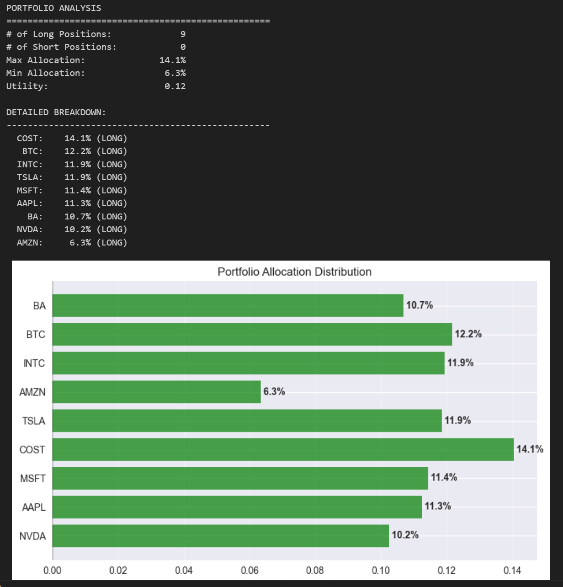

# Optimal Portfolio Allocation

A Python tool for calculating optimal investment portfolio allocations based on Modern Portfolio Theory. This application analyzes historical stock data, calculates risk-return characteristics, and determines the optimal portfolio weights that maximize utility for a given risk preference.

## Features

- **Stock Data Retrieval**: Fetches historical price data from Yahoo Finance using the yfinance API
- **Return Analysis**: Calculates and visualizes the distribution of daily returns for each stock
- **Correlation Analysis**: Computes and displays correlation coefficients across all stocks in the portfolio
- **Portfolio Optimization**: Solves for optimal asset weights that maximize investor utility based on specified risk aversion

## Theory

The optimization is based on Modern Portfolio Theory, which seeks to maximize the utility function:

U = wᵀμ - (A/2)wᵀΣw

Where:
- w = vector of portfolio weights
- μ = vector of expected returns
- Σ = covariance matrix of returns
- A = risk aversion parameter

The solution provides the optimal asset allocation that balances expected returns against portfolio risk according to the investor's specific risk tolerance.

## Usage

1. Input the list of stocks you want to include in your portfolio
2. The application automatically fetches historical price data from Yahoo Finance
3. Analyze the distribution of daily returns for each stock:
   
5. Review correlation relationships between all stocks:
   
6. Specify your risk aversion parameter (higher values indicate greater risk aversion)
7. The tool calculates, using gradient descent with Adam optimizer, the optimal portfolio allocation that maximizes your utility function.
   
- **Risk Management**: Use correlation insights to balance portfolio concentration and avoid unintended risk overlaps
- **Diversification**: Construct portfolios with low-correlation assets to reduce overall portfolio risk without sacrificing expected returns
  
- **Hedging**: Implement long-short strategies on highly correlated assets to mitigate specific risk exposures
  
8. An interactive window display

## Requirements

- Python 3.12+
- yfinance
- pandas
- numpy
- matplotlib
- scipy

