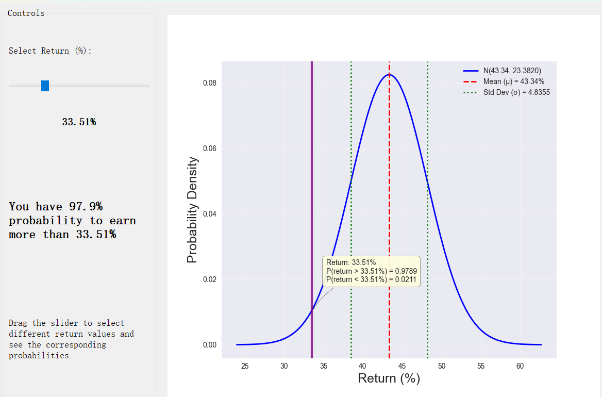

# 📊 Optimal Portfolio Allocation using Modern Portfolio Theory

A comprehensive Python tool for calculating optimal investment portfolio allocations based on Modern Portfolio Theory. This application analyzes historical stock data, calculates risk-return characteristics, and determines optimal portfolio weights using advanced optimization algorithms including Adam, Gradient Descent, and Closed-Form solutions.

## ✨ Features

### 🎯 **Multi-Asset Portfolio Optimization**
- **9 Diversified Assets**: Technology (NVDA, AAPL, MSFT, INTC), E-commerce (AMZN), Automotive (TSLA), Retail (COST), Aerospace (BA), Cryptocurrency (BTC)
- **Sector Diversification**: Balanced exposure across different market sectors
- **Risk Management**: Long-only and long-short portfolio strategies

### 📈 **Advanced Data Analysis**
- **Hybrid Methodology**: Daily data for training (2024), monthly data for testing (2025)
- **Statistical Analysis**: Comprehensive return distribution analysis with Gaussian fitting
- **Correlation Analysis**: Full correlation matrix with heatmap visualization
- **Risk Metrics**: Volatility, Sharpe ratio, maximum drawdown calculations

### 🧠 **Multiple Optimization Algorithms**
- **Adam Optimization**: Adaptive moment estimation with momentum and learning rate adaptation
- **Gradient Descent**: Classical first-order optimization method
- **Closed-Form Solution**: Analytical solution using matrix inversion
- **Convergence Analysis**: Learning curves and optimization performance comparison

### 🎮 **Interactive Features**
- **Real-time GUI**: PyQt5-based interactive distribution explorer
- **Dynamic Sliders**: Adjust return thresholds and see probability calculations
- **Visual Analytics**: Comprehensive charts and statistical visualizations
- **Performance Tracking**: Out-of-sample testing with real market data

## 🔬 Theory

The optimization is based on **Modern Portfolio Theory**, which seeks to maximize the utility function:

$$
U = \mathbf{w}^T \boldsymbol{\mu} - \frac{A}{2} \mathbf{w}^T \boldsymbol{\Sigma} \mathbf{w}
$$

**Subject to constraints:**
- Budget constraint: $\sum_{i=1}^{n} w_i = 1$ (weights sum to 100%)
- Long-only constraint: $w_i \geq 0$ (no short selling)

**Where:**
- $U$ = Investor's utility function
- $\mathbf{w}$ = Vector of portfolio weights ($w_1, w_2, ..., w_n$)
- $\boldsymbol{\mu}$ = Vector of expected returns (from 2024 daily data)
- $\boldsymbol{\Sigma}$ = Covariance matrix of asset returns (from 2024 daily data)
- $A$ = Risk aversion coefficient (higher values = more risk averse)

## 🚀 Usage

### 1. **Data Collection & Processing**
```python
# The application automatically fetches historical data
# Training: 2024 daily data for optimization
# Testing: 2025 monthly data for evaluation
```

### 2. **Statistical Analysis**
Analyze the distribution of daily returns for each stock:


### 3. **Correlation Analysis**
Review correlation relationships between all stocks:


### 4. **Portfolio Optimization**
Choose your optimization algorithm and risk aversion parameter:
- **Adam**: Advanced optimization with adaptive learning rates
- **Gradient Descent**: Classical optimization method
- **Closed-Form**: Analytical solution


### 5. **Portfolio Allocation Results**
View optimal asset allocations and performance metrics:

**Long-Short Portfolio Example:**


### 6. **Interactive Analysis**
Explore return probabilities with the interactive GUI:


### 7. **Out-of-Sample Testing**
Evaluate portfolio performance using real 2025 market data:
- **Expected vs Actual Returns**: Compare predictions with reality
- **Risk-Adjusted Performance**: Sharpe ratio and volatility analysis
- **Individual Asset Contributions**: See which positions drove performance

## 📊 Key Results

### **Portfolio Performance (Example)**
**Example of a report** <br>

<br>**Geometric Brownian Motion** <br>


