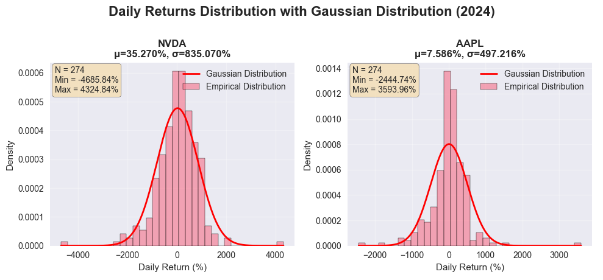

# 📊 Optimal Portfolio Allocation

A comprehensive Python project for optimal portfolio allocation using various optimization strategies, robust estimation methods, and Monte Carlo simulation. This project implements modern portfolio theory techniques to construct efficient portfolios and analyze their performance.

## Features

- **Data Processing**: Download and process stock data from Yahoo Finance
- **Robust Estimation**: Campbell's robust method for mean and covariance estimation to handle outliers
- **Shrinkage Estimators**: James-Stein type shrinkage for reducing estimation error
- **Portfolio Optimization**: Multiple optimization strategies including:
  - Maximum Utility Portfolio
  - Minimum Variance Portfolio (MVP)
  - Maximum Sharpe Ratio Portfolio
  - Return per Risk Portfolio
- **Visualization**: Comprehensive plots for data analysis, portfolio performance, and distributions
- **Monte Carlo Simulation**: Geometric Brownian Motion simulation for portfolio value forecasting

## Installation

### Requirements

```bash
pip install numpy pandas matplotlib seaborn scipy yfinance
```

Or install from requirements.txt (if available):

```bash
pip install -r requirements.txt
```

## Project Structure

```
Optimal_Portfolio_Allocation/
│
├── main.ipynb              # Main notebook with complete workflow
├── load_data.py            # Data loading and visualization functions
├── optimization.py         # Portfolio optimization strategies
├── rubust_mean_cov.py      # Robust mean and covariance estimation
├── Shrinkage.py            # Shrinkage estimator for mean returns
├── GBM.py                  # Geometric Brownian Motion simulation
├── demo/                   # Demo images and visualizations
│   ├── Data_insight.png
│   ├── dist_list.png
│   ├── BackTest_and_report_weight.png
│   └── MC_sim.png
└── README.md
```

## Usage

### Basic Workflow

1. **Import required modules**:
```python
from load_data import load_data, plot_insight, plot_distribution
from optimization import mvp, MaxSharpe, Max_util, RtnPerRisk, plot_port, expand_weights, active
from Shrinkage import shrinkage_mean_return
from GBM import GBM_simulation
from rubust_mean_cov import campbell_robust_est
```

2. **Load and process data**:
```python
stock_list = ["NVDA", "AAPL", "MSFT", "GOOG", "TSLA", "AMZN"]
rtn, prices = load_data(stock_list)
mean_rtn = rtn.mean().to_numpy()
cov_m = rtn.cov().to_numpy()
cor_m = rtn.corr()
plot_insight(cor_m, prices)
```

3. **Apply robust estimation**:
```python
mean_rtn, cov_m = campbell_robust_est(rtn, b1=2, b2=1.24)
plot_distribution(rtn, stock_list)
```

4. **Construct portfolio**:
```python
# Set parameters
A = 200  # Risk aversion parameter
r = 0.045  # Risk-free rate
r_daily = r/252
target_return = 0.005
Shrinkage = True

# Short selling constraints (1 = allowed, 0 = not allowed)
short_res = [1, 1, 1, 1, 1, 1]

# Apply shrinkage if enabled
if Shrinkage:
    shrinkage_mean = shrinkage_mean_return(rtn, stock_list)
    mean_rtn_active = shrinkage_mean

mean_rtn_active, cov_m_active = active(short_res, mean_rtn, cov_m)

# Choose optimization strategy
w = MaxSharpe(mean_rtn_active, cov_m_active, r_daily)
w = expand_weights(w, short_res)

# Plot portfolio analysis
mu_port, sigma_port = plot_port(w, mean_rtn, cov_m, rtn, stock_list, A)
```

5. **Monte Carlo Simulation**:
```python
T = 1/12  # 1 month
N = int(T*252)
S0 = 100
M = 1000

sim_value = GBM_simulation(
    vol_annual=sigma_port*100,
    mu_annual=mu_port*100,
    S0=S0,
    T=T,
    N=N,
    M=M
)
```

## Visualization Examples

### Data Insights


The data insight plot shows:
- Correlation matrix heatmap displaying relationships between assets
- Price history time series for all stocks in the portfolio

### Return Distribution Analysis


This visualization compares empirical return distributions with Gaussian distributions for each stock, providing insights into the distribution characteristics and normality assumptions.

### Portfolio Performance and Weights


Comprehensive portfolio analysis including:
- Cumulative return over time
- Return distribution histogram with normal distribution overlay
- Portfolio weight allocation across assets

### Monte Carlo Simulation


Geometric Brownian Motion simulation results:
- Simulated price paths over time
- Terminal value distribution with lognormal fit
- Statistical summary (mean and standard deviation)

## Portfolio Optimization Strategies

### 1. Maximum Utility Portfolio (`Max_util`)
Maximizes the utility function: U = μ - 0.5 × A × σ²
- `A`: Risk aversion parameter

### 2. Minimum Variance Portfolio (`mvp`)
Minimizes portfolio variance
- Optional `target_return` parameter for constrained optimization

### 3. Maximum Sharpe Ratio Portfolio (`MaxSharpe`)
Maximizes (μ_p - r) / σ_p
- `r`: Risk-free rate

### 4. Return per Risk Portfolio (`RtnPerRisk`)
Inverse variance weighting approach

## Robust Estimation Methods

### Campbell's Robust Estimation
Uses Mahalanobis distances to identify and downweight outliers:
- More robust than sample mean and covariance
- Parameters: `b1` (threshold), `b2` (bandwidth)

### Shrinkage Estimator
James-Stein type shrinkage that shrinks sample means toward the minimum variance portfolio return:
- Reduces estimation error in small samples
- Particularly useful when sample size is limited

## Key Functions

### Data Loading (`load_data.py`)
- `load_data(stock_list)`: Download and calculate log returns
- `plot_insight(cor_m, prices)`: Visualize correlation and prices
- `plot_distribution(rtn, stock_list)`: Plot return distributions

### Optimization (`optimization.py`)
- `cal_mean_var(weights, mean_np, cov_np)`: Calculate portfolio return and variance
- `cal_util(mu, var, A)`: Calculate utility
- `mvp(mean_rtn, cov_m, target_return=None)`: Minimum variance portfolio
- `MaxSharpe(mean_rtn, cov_m, r)`: Maximum Sharpe ratio portfolio
- `Max_util(mean_rtn, cov_m, A)`: Maximum utility portfolio
- `plot_port(w, mean_rtn, cov_m, rtn, stock_list, A)`: Comprehensive portfolio visualization

### Robust Estimation (`rubust_mean_cov.py`)
- `campbell_robust_est(rtn, b1=2.0, b2=1.25)`: Robust mean and covariance estimation

### Shrinkage (`Shrinkage.py`)
- `shrinkage_mean_return(rtn, stock_list)`: Shrinkage estimator for mean returns

### Simulation (`GBM.py`)
- `GBM_simulation(vol_annual, mu_annual, S0, T, N, M, m_show=100)`: Geometric Brownian Motion simulation

## Parameters

- **Risk Aversion (A)**: Higher values indicate greater risk aversion
- **Risk-free Rate (r)**: Used for Sharpe ratio calculation
- **Short Selling Constraints**: Binary vector indicating which assets can be shorted
- **Shrinkage**: Boolean flag to enable/disable shrinkage estimation

## Notes

- All portfolios are normalized to sum to 1
- Log returns are used throughout for computational convenience
- The project assumes daily returns for calculations
- Monte Carlo simulation uses a fixed random seed for reproducibility

## License

This project is provided as-is for educational and research purposes.

## Author

Financial Portfolio Optimization Project

